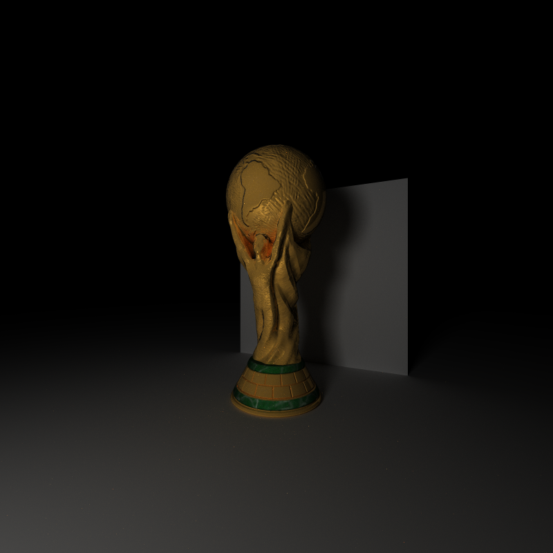
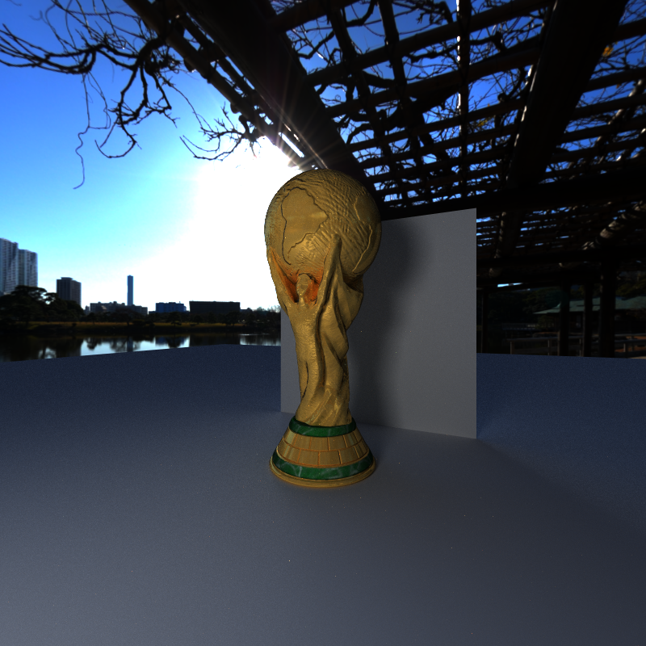
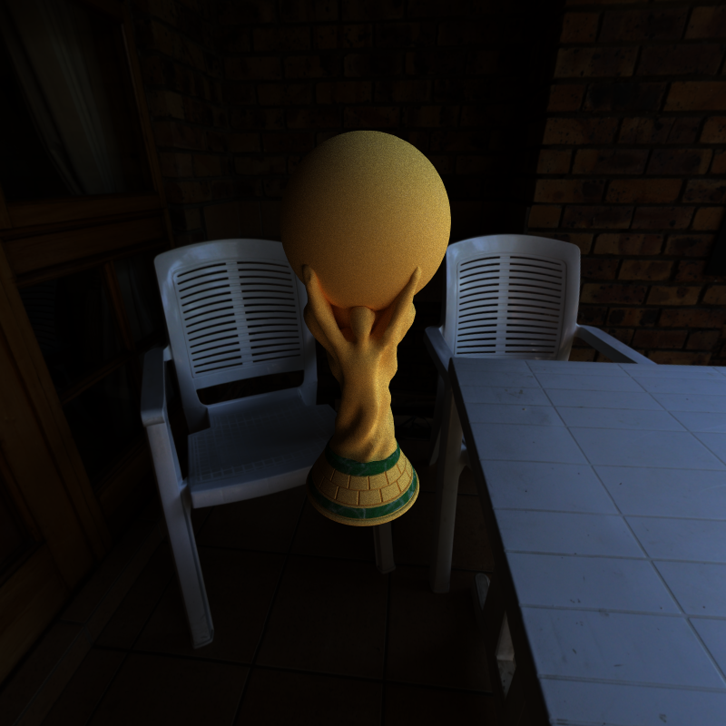
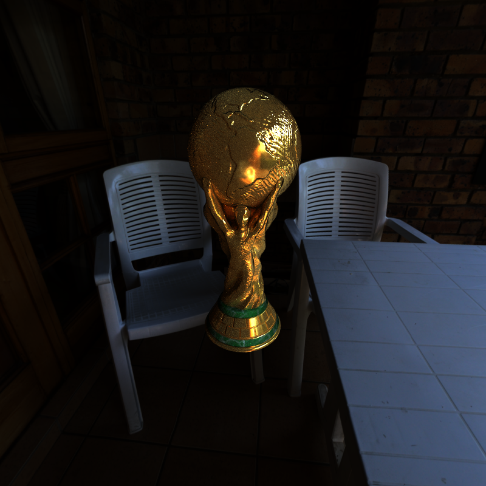
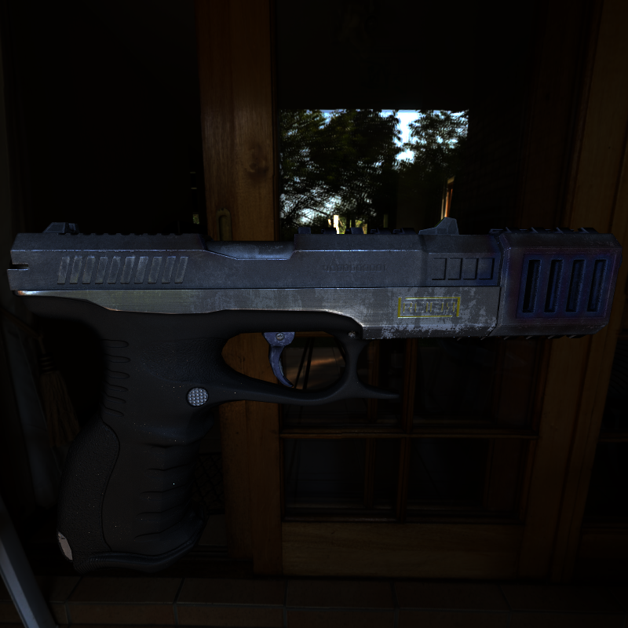
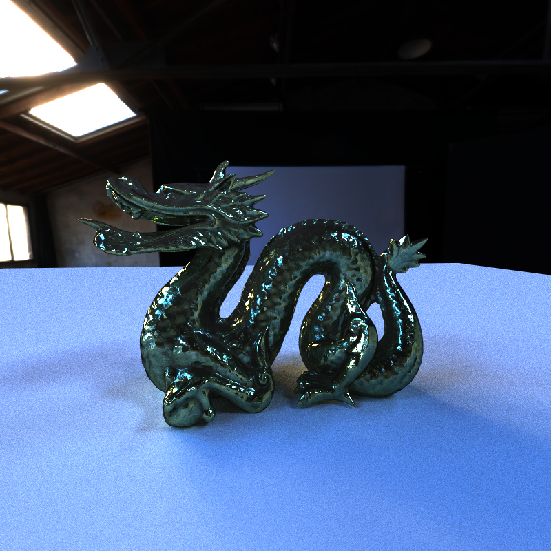
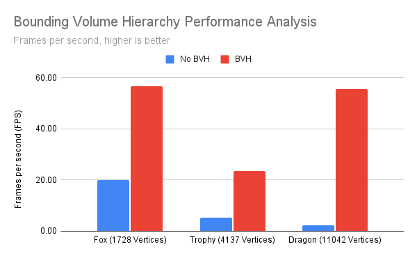
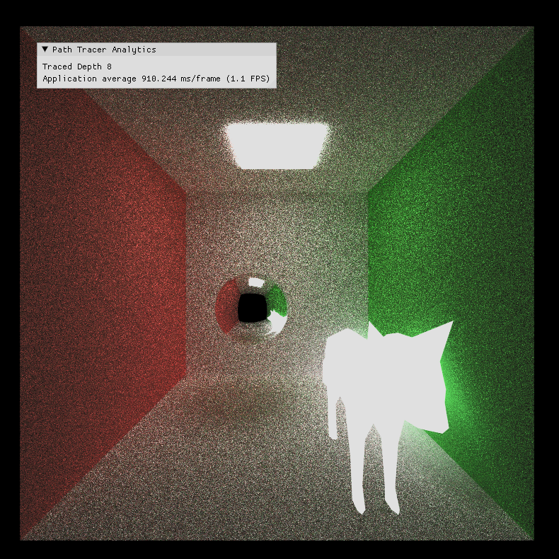
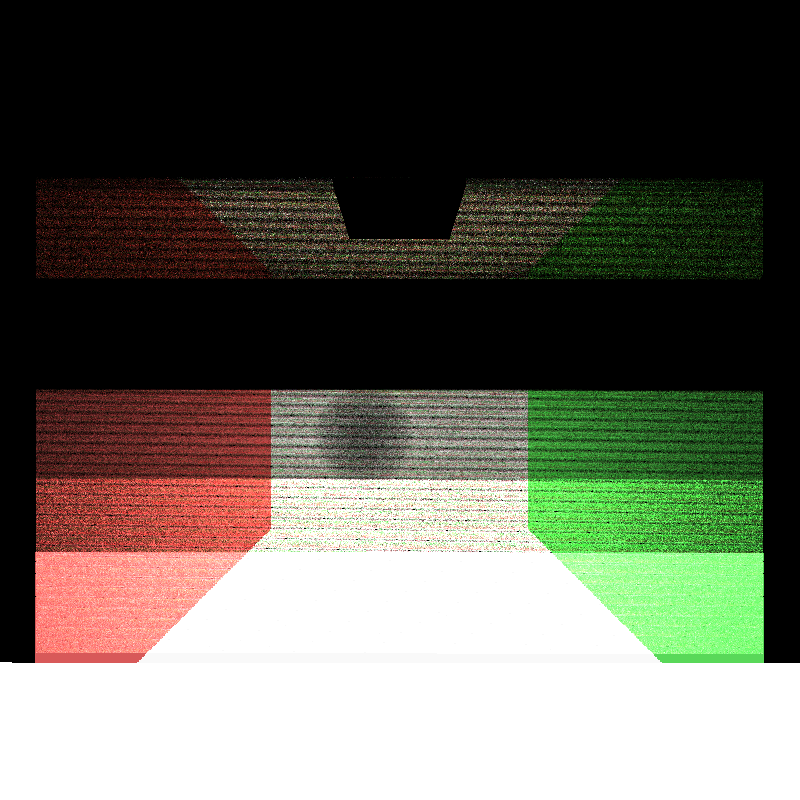

CUDA Path Tracer
================

**University of Pennsylvania, CIS 565: GPU Programming and Architecture, Project 3**

* Ruben Young
  * [LinkedIn](https://www.linkedin.com/in/rubenaryo/), [Personal Site](https://rubenaryo.com)
* Tested on: Windows 11, AMD Ryzen 7 7800X3D, RTX 4080 SUPER (Compute Capability 8.9)


World Cup Trophy @ 2560x1440, 5000 Samples per pixel ([Model Link](https://sketchfab.com/3d-models/world-cup-trophy-e28e9b2d3c374303974bd9898bbb2a64))

### Overview
This is a CUDA-based Monte-Carlo Path Tracer built to experiment with writing highly parallel programs and implementing different rendering methods at a low-level.

Monte-Carlo Path Tracing is a classic technique for offline rendering of photo-realistic images. We reverse the real-world process of light bouncing across different surfaces by instead integrating the accumulation of light arriving on an object's surface by approximating [Kajiya's light transport equation](https://en.wikipedia.org/wiki/Rendering_equation).

In addition to a core implementation, this program supports:
- Multiple Importance Sampling
- Texture Mapping (Diffuse, Normal, Metallic/Roughness)
- Environment Mapping (HDR)
- Physically Based Shading using the Cook-Torrance microfacet model
- Loading of GLTF-based meshes
- Bounding Volume Hierarchies (BVH)

### Multiple Importance Sampling

|  |  |  | 
|:--:|:--:|:--:| 
|500 Samples (MIS Off): 37.3 FPS|500 Samples (MIS On): 34.2 FPS|Direct Lighting only |

In a naive path tracing implementation, rays are bounced around the scene up to a maximum depth, and useful light information is gained only when the chain resolves in an intersection with a light source. However, rays that bounce around the scene but never collide with a light source are simply discarded, which is incredibly wasteful.

Multiple Importance Sampling (MIS) is an incredibly useful technique for addressing this. At each bounce, not only is the surface's BRDF sampled such that the color throughput is modified, but the light is directly sampled by selecting one of the lights in the scene at random and weighing it appropriately. As such, useful luminance information is always gathered for a given pixel at each simulation step, rather than just on the ones where we happen to hit the light.

We take a modest performance loss per-frame, but the result approximates to a clearer, less noisy image in much less time.

As with most core path-tracing features, MIS benefits immensely from parallelization, as each ray is independent and only relies on static data from the scene. Doing this on the CPU would scale poorly as resolution increases, with each path having to execute in sequence.

### Texture Mapping (Diffuse, Normal, Metallic/Roughness)

|  |  |
|:--:|:--:|
|5000 Samples (Base): 43.7 FPS|5000 Samples (Textured): 43.2 FPS|

Texture Mapping is a core part of giving life to any model. This path tracer supports diffuse, normal, and metallic/rough texture maps in the physically-based shading kernel.

There is some performance overhead every time a texture is sampled, as multiple threads may have all hit the same geometry and need to read the same texture from global memory simultaneously. There is also the requirement to compute UV coordinates, tangents, and bitangents, but this is minimal when compared to the memory access limitations. 

Fortunately, we only see a minimal performance dip when shading, from 43.7 -> 43.2 FPS. 

Much like with MIS, a CPU implementation would suffer from paths having to be processed sequentially, although it would not suffer from the same drawbacks of simultaneous global device memory reads.

### Environment Mapping

|  |  |
|:--:|:--:|
|2000 Samples: 11.2 FPS|2000 Samples: 10.8 FPS|

Environment mapping is also a great way to add detail to a scene. This path tracer supports loading of .hdr environment maps, which serve as a skybox for the scene. This is important for global illumination and can help with convergence, as even rays that miss explicit light geometries can retrieve useful light information by sampling the environment map's luminance.

Much like with regular texture mapping, there is overhead in sampling environment maps as multiple rays could be trying to read from the same global memory addresses. The same issues for a hypothetical CPU implementation would also apply. 

We see a similar performance drop as weith texture mapping. 11.2 FPS -> 10.8 FPS

This is an area I would like to expand on for future work. There are many benefits to importance sampling environment maps by building diffuse/glossy convolutions as a preprocess.

### Physically-Based Rendering

|  |  |
|:--:|:--:|
|2500 Samples (Lambertian Material): 22.3 FPS|2500 Samples (Microfacet PBR Material): 22.2 FPS|

This path tracer employs the [Cook-Torrance] (https://graphicscompendium.com/gamedev/15-pbr) microfacet reflectance model to produce physically accurate, photorealistic results. This reflection model employs the commonly used Schlick approximation for the fresnel term in order to produce specular highlights.

Using metallic/roughness textures combined with custom GLTF models allows for many options for scene composition. 

We also only see a negligible performance impact from using the PBR kernel, despite the additional texture lookup: 22.3 FPS -> 22.2 FPS

Much like with the other rendering features, a hypothetical CPU implementation would suffer from being sequential.

### Loading GLTF Models

|  |  |
|:--:|:--:|
|[9MM Pistol](https://sketchfab.com/3d-models/9-mm-5124e7fe60fb4d3ab62460609d23f365) (5000 Samples)|[Stanford Dragon](https://sketchfab.com/3d-models/stanford-dragon-pbr-5d610f842a4542ccb21613d41bbd7ea1) (5000 Samples)|

There is support for GLTF-based models. This path tracer makes use of [tinygltf](https://github.com/syoyo/tinygltf) for parsing, and the loading process batches the underlying vertex data by specified material in the GLTF file. 

All models are drawn as indexed, and for models which contain no indices, they are generated automatically. 

In order to load a model, it must be specified with the "mesh" geometry type in the scene's json file. No materials need to be specified as they are read automatically. Any corresponding textures will also be looked up and loaded if present.

For further performance discussion, see the section on Bounding Volume Hierarchies.

### Bounding Volume Hierarchies

This path tracer makes use of Bounding Volume Hierarchies (BVH) for ray-triangle intersect detection. A BVH is a spatial data structure that groups closely positioned triangles into buckets defined by Axis-Aligned Bounding Boxes stored as a tree. This tree is built and then transferred to the device by the host at load-time. Each ray traverses the data structure when searching for possible collions within its path, leading to a massive speed up.

We see a large discrepancy in the impact using a BVH has on FPS. There is clearly overhead in additionally testing each AABB, as shown by the much smaller Fox model having a similar post-BVH performance as the Dragon. However, it is curious that the Dragon ends up with such high performance after the fact, especially when compared to the Trophy, which did not even reach 30 FPS. 

One possible explanation is that the BVH approach used splits the vertices simply by axis, whereas a smarter heuristic such as the resulting surface area might yield a better lookup result due to more even spread of triangles per each bounding box. This is an optimization to look into for the future.

|  | 
|:--:| 
| Somewhat unexpected results |

### Stream Compaction and Material Sorting

An important element of building a path tracer is stream compaction. After each bounce, it is important to reorganize the list of paths such that all non-terminated paths are contiguous in memory and can be batch processed together with the minimum threads required. 

Additionally, we build sortkeys based on the materials hit after each bounce. Therefore, the paths are further organized by Material Type so that all those threads can be dispatched to separate material kernels. This further optimizes shading as different material kernels have different amounts of work required.

To demonstrate the inefficiency of not stream compacting, we can clearly see that for an open scene, about 5/6 of all the rays terminate after just one bounce. This can clog up thread utilization.

```
[0] 640000 -> 352181    (287819 terminated)
[1] 352181 -> 107445    (532555 terminated)
[2] 107445 -> 49617     (590383 terminated)
[3] 49617  -> 23748     (616252 terminated)
[4] 23748  -> 14496     (625504 terminated)
[5] 14496  -> 8988      (631012 terminated)
[6] 8988   -> 6432      (633568 terminated)
[7] 6432   -> 4717      (635283 terminated)
```

In a closed scene, the rays don't terminate nearly as quickly, with about half still doing useful work by the third bounce.
```
[0] 640000 -> 530019    (109981 terminated)
[1] 523667 -> 369954    (270046 terminated)
[2] 363207 -> 286713    (353287 terminated)
[3] 282126 -> 235661    (404339 terminated)
[4] 232407 -> 200483    (439517 terminated)
[5] 198068 -> 174252    (465748 terminated)
[6] 172341 -> 154178    (485822 terminated)
[7] 152719 -> 138469    (501531 terminated)
```

### A note on material sorting and zip iterators

A common suggestion online to the need to sort multiple arrays in parallel is to use thrust's "zip iterators", which effectively bind together operations to a set of parallel arrays. While convenient, I observed significant performance drops from doing this!

In my testing, zip iterators roughly *halved* my performance. While more investigation is needed, this is likely due to stalling from now-dependent memory reads/writes to global memory (Long Scoreboard Stall).

In short, don't use them!

## Bloopers





## Additional Files 
Added to CMakeLists.txt in addition to those from the base code.
- bsdf.h/cu 
- light.h/cu
- bvh.h/cu