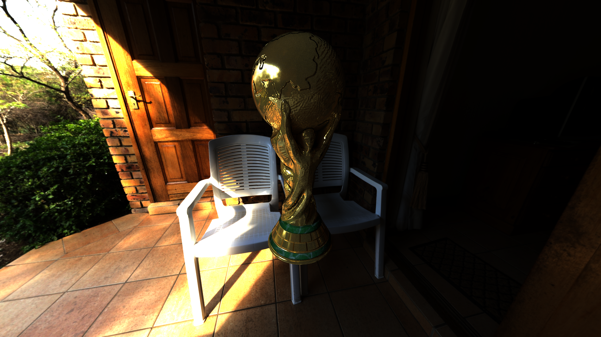
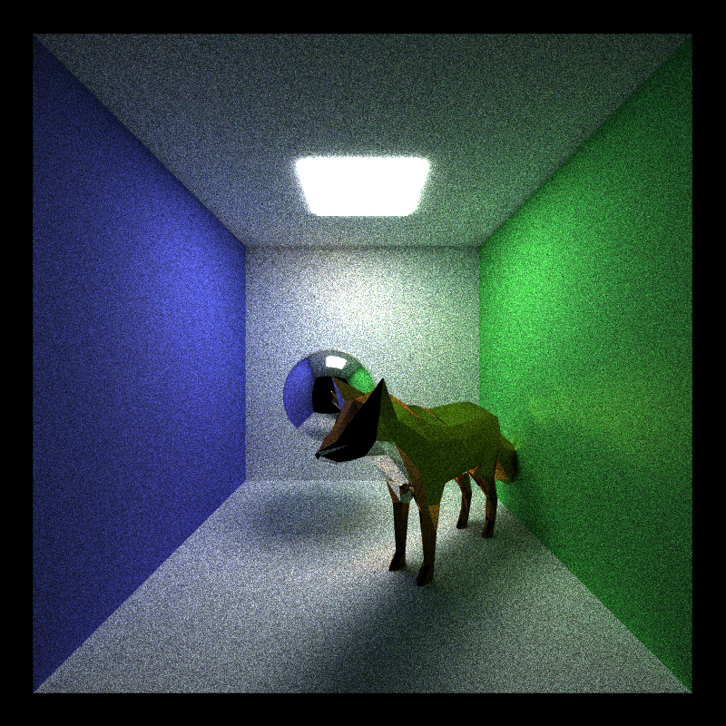
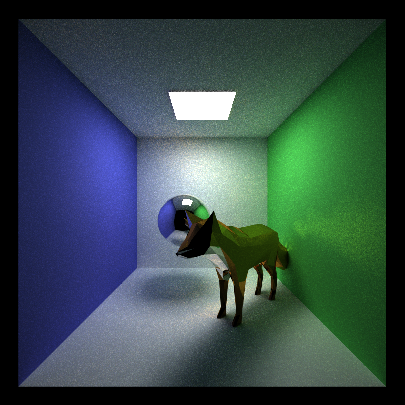
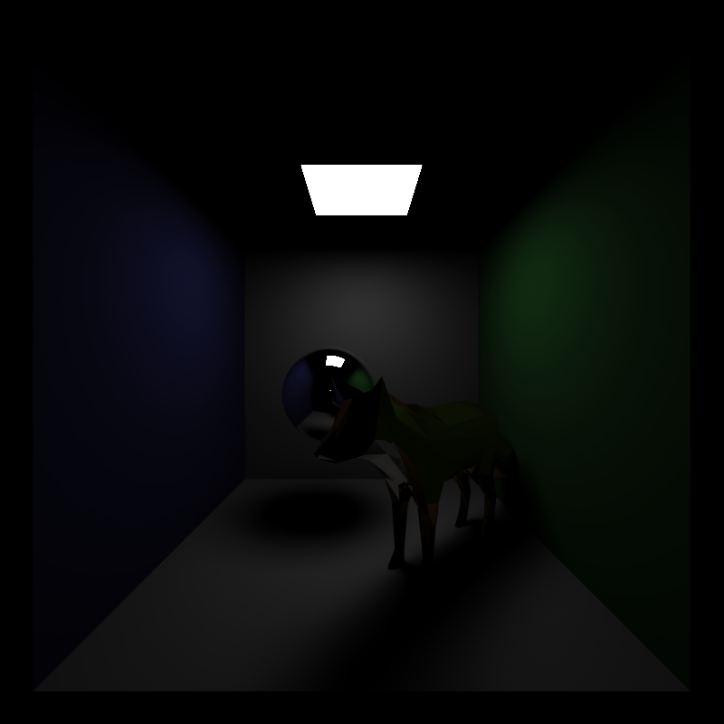
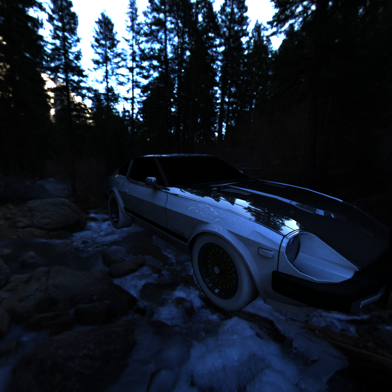
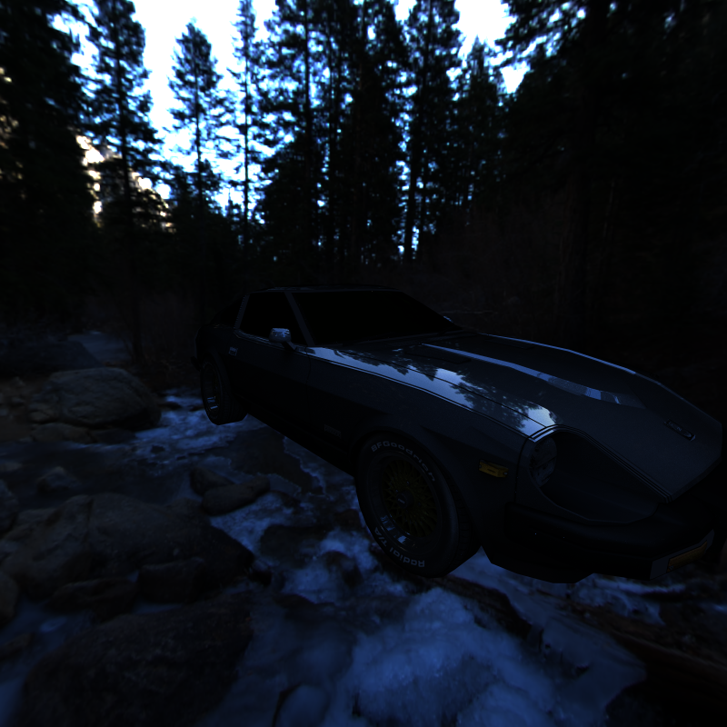

CUDA Path Tracer
================

**University of Pennsylvania, CIS 565: GPU Programming and Architecture, Project 3**

* Ruben Young
  * [LinkedIn](https://www.linkedin.com/in/rubenaryo/), [Personal Site](https://rubenaryo.com)
* Tested on: Windows 11, AMD Ryzen 7 7800X3D, RTX 4080 SUPER (Compute Capability 8.9)

### Overview
This is a CUDA-based Monte-Carlo Path Tracer built to experiment with writing highly parallel programs and implementing different rendering methods at a low-level.

Monte-Carlo Path Tracing is a classic technique for offline rendering of photo-realistic images. We reverse the real-world process of light bouncing across different surfaces by instead integrating the accumulation of light arriving on an object's surface by approximating [Kajiya's light transport equation](https://en.wikipedia.org/wiki/Rendering_equation).

In addition to a core implementation, this program supports:
- Multiple Importance Sampling
- Texture Mapping (Diffuse, Normal, Metallic/Roughness)
- Environment Mapping (HDR)
- Physically Based Shading using the Cook-Torrance microfacet model
- Custom loading of GLTF-based meshes
- Bounding Volume Hierarchies (BVH)

### Multiple Importance Sampling

|  |  |  | 
|:--:|:--:|:--:| 
|500 Iterations (MIS Off): 37.3 FPS|500 Iterations (MIS On): 34.2 FPS|Direct Lighting only |

In a naive path tracing implementation, rays are bounced around the scene up to a maximum depth, and useful light information is gained only when the chain resolves in an intersection with a light source. However, rays that bounce around the scene but never collide with a light source are simply discarded, which is incredibly wasteful.

Multiple Importance Sampling (MIS) is an incredibly useful technique for addressing this. At each bounce, not only is the surface's BRDF sampled such that the color throughput is modified, but the light is directly sampled by selecting one of the lights in the scene at random and weighing it appropriately. As such, useful luminance information is always gathered for a given pixel at each simulation step, rather than just on the ones where we happen to hit the light.

We take a modest performance loss per-frame, but the result approximates to a clearer, less noisy image in much less time.

As with most core path-tracing features, MIS benefits immensely from parallelization, as each ray is independent and only relies on static data from the scene. Doing this on the CPU would scale poorly as resolution increases, with each path having to execute in sequence.

## - Texture Mapping (Diffuse, Normal, Metallic/Roughness)

|  |  |
|:--:|:--:|
|5000 Iterations (Base): 43.7 FPS|5000 Iterations (Textured): 43.2 FPS|

Texture Mapping is a core part of giving life to any model. This path tracer supports diffuse, normal, and metallic/rough texture maps in the physically-based shading kernel.

There is some performance overhead every time a texture is sampled, as multiple threads may have all hit the same geometry and need to read the same texture from global memory simultaneously. There is also the requirement to compute UV coordinates, tangents, and bitangents, but this is minimal when compared to the memory access limitations. 

Fortunately, we only see a minimal performance dip when shading, from 43.7 -> 43.2 FPS. 

Much like with MIS, a CPU implementation would suffer from paths having to be processed sequentially, although it would not suffer from the same drawbacks of simultaneous global device memory reads.

## Additional Files 
Added to CMakeLists.txt in addition to those from the base code.
- bsdf.h/cu 
- light.h/cu
- bvh.h/cu